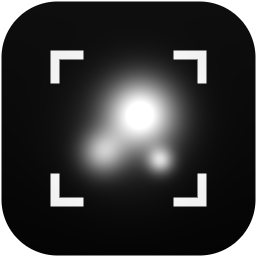
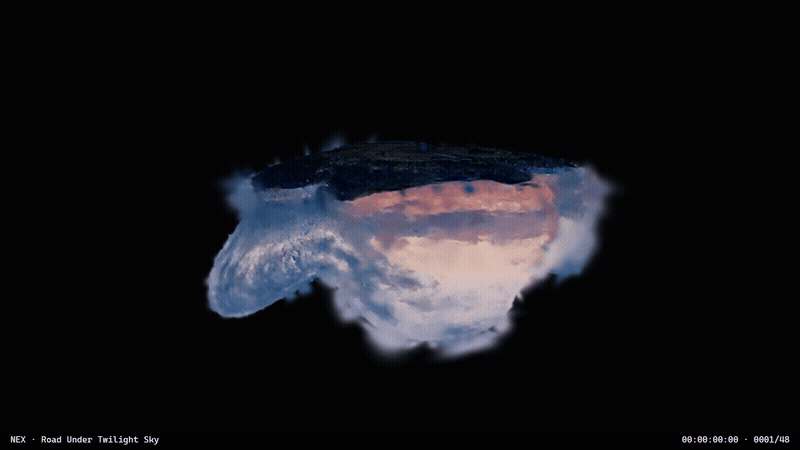
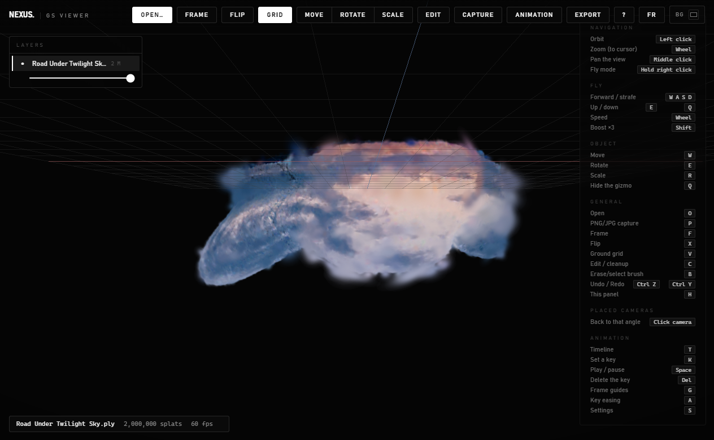
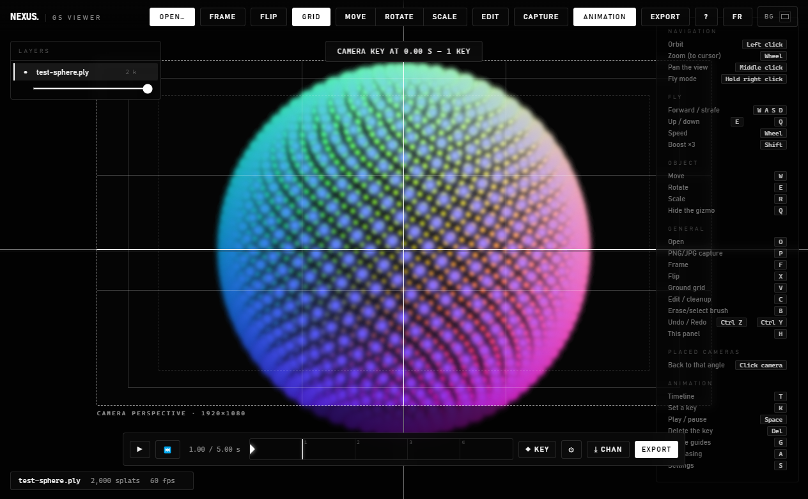
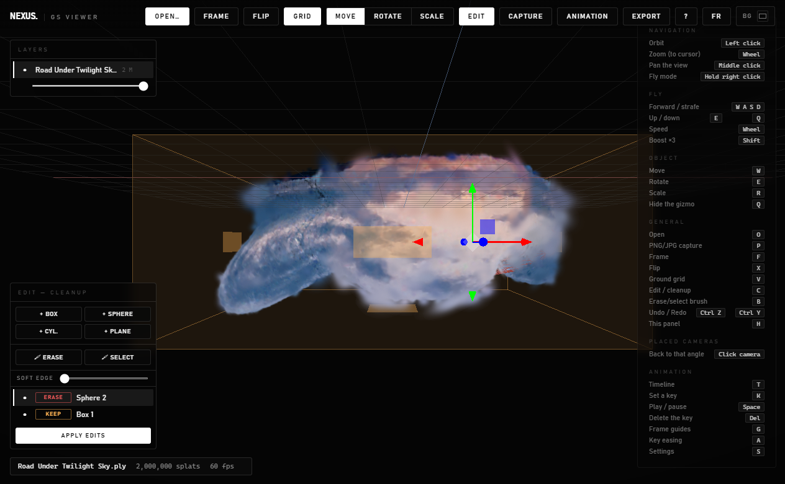
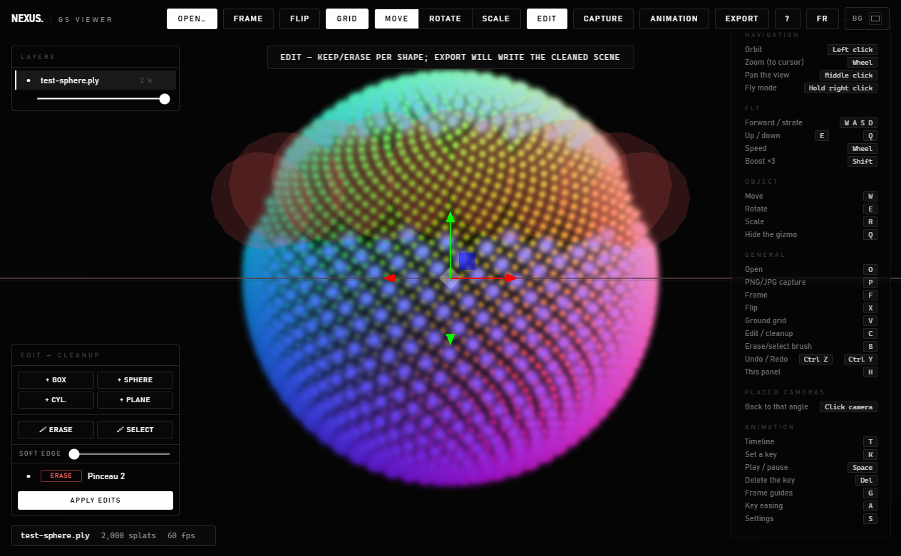

<div align="center">



# NEX GS Viewer

**Visionner, nettoyer, animer et exporter des Gaussian Splats — un éditeur de splats pensé playblast, taillé pour les pipelines VFX.**


[English](../README.md) | **Français**

📬 Je construis des outils de pipeline IA × VFX. Suis les sorties et les breakdowns → [Patrick Crucke sur LinkedIn](https://www.linkedin.com/in/patrick-crucke/)



</div>

---

## Ce que ça fait

**NEX GS Viewer** est une visionneuse **et un éditeur** de Gaussian Splatting autonome pour Windows. Glisse un `.ply`, `.spz`, `.splat` ou `.ksplat` et tu obtiens un viewer fluide à 60 fps avec des calques façon Photoshop — plus les deux choses qui manquent à la plupart des viewers de splats :

- une **timeline d'animation caméra** avec cadre caméra façon Blender, qui exporte des **playblasts** (MP4, séquences PNG alpha) et des **caméras Nuke** (`.chan`, dans les deux sens),
- une **panoplie de nettoyage** complète — formes Garder/Effacer, pinceau gomme, sélection de splats avec couper/copier/coller vers des calques, bake destructif — pour transformer un scan brut en asset propre et ré-exportable sans quitter l'app.

C'est le pont manquant entre les outils d'entraînement de splats et ton pipeline de compositing — 100 % local : pas de compte, pas de cloud, pas de télémétrie.

## Pourquoi c'est utile

Les scans Gaussian Splat sortent bruités de l'entraînement — flottants, sol parasite, bords cramés — et les reviewer se résume souvent à filmer son écran. Avec NEX GS Viewer, l'outil qui nettoie le scan est aussi celui qui bloque le plan : pose des clés caméra comme dans un DCC, exporte un playblast 1080p/4K avec timecode incrusté, donne la caméra `.chan` correspondante à Nuke, et compose directement la séquence PNG alpha. Un scan passe d'*entraîné* à *dans le comp* en quelques minutes.

## Fonctionnalités

- 🚀 **Rapide** — lecture en flux des gros scans, 2 000 000 de splats à 60 fps sur un GPU moderne
- 🗂️ **Calques** — un par fichier : renommage, visibilité, opacité par calque, gizmo déplacer/pivoter/échelle
- 🎬 **Timeline caméra** — clés avec amorti par clé, courbes Catmull-Rom, cadre caméra façon Blender avec guides de composition (tiers, zones safe)
- 📼 **Export playblast** — MP4 (H.264) ou **séquence PNG avec alpha**, formats fixes 1080p/4K/Scope/vertical, timecode incrusté en option
- 🎥 **Aller-retour caméra Nuke** — exporte la caméra animée en `.chan`, ou importe un `.chan` tracké depuis Nuke et rejoue-le sur les splats
- 🧹 **Formes de nettoyage** — boîtes, sphères, cylindres et plans de coupe en mode **Garder** / **Effacer** / **Sélection**, bord doux, masquage SDF temps réel
- 🖌️ **Pinceaux** — peins directement sur les splats pour effacer ou sélectionner (molette = rayon)
- ✂️ **Opérations de sélection** — extraire (couper), dupliquer (copier/coller) ou supprimer la sélection ; les splats extraits deviennent un calque déplaçable
- 🔥 **Bake** — applique les édits destructivement (annulable), puis itère : trancher le sol → appliquer → gommer les flottants → appliquer
- 💾 **Sidecar de scène** — calques, transformations, animation, formes et réglages s'enregistrent automatiquement à côté du fichier et se restaurent à la réouverture
- ↩️ **Annuler/rétablir** partout — y compris bakes et extractions
- 🖥️ **CLI headless** — rends des playblasts en batch depuis un script
- 🌐 **Interface anglais / français** (`L` ou le bouton FR/EN)
- 🆓 **MIT, entièrement local** — tes scans ne quittent jamais ta machine

## Captures

| Viewer — 2M splats @ 60 fps | Timeline & cadre caméra |
| :---: | :---: |
|  |  |
| **Formes de nettoyage (Garder / Effacer)** | **Pinceau gomme** |
|  |  |

## Installation

### Option 1 — Build release (recommandé)

**Windows**

1. Télécharge le dernier `NEX-GS-Viewer-win32-x64.zip` dans les [**Releases**](https://github.com/NXStorm/nex-gs-viewer/releases)
2. Dézippe où tu veux (ex. `C:\Outils\NEX GS Viewer\`)
3. Lance `NEX GS Viewer.exe`

Au premier lancement, l'app s'enregistre (par utilisateur, sans droits admin) : `.spz`, `.splat` et `.ksplat` s'ouvrent au double-clic, et `.ply` reçoit une entrée « Ouvrir avec ».

**macOS** (Apple Silicon : `macos-arm64` · Intel : `macos-x64`)

1. Télécharge le `NEX-GS-Viewer-macos-*.zip` correspondant dans les [**Releases**](https://github.com/NXStorm/nex-gs-viewer/releases)
2. Dézippe et glisse `NEX GS Viewer.app` dans Applications
3. Premier lancement uniquement — l'app n'est pas notarisée : **clic droit → Ouvrir → Ouvrir**, ou :
   ```bash
   xattr -cr "/Applications/NEX GS Viewer.app"
   ```

### Option 2 — Depuis les sources

```bash
git clone https://github.com/NXStorm/nex-gs-viewer.git
cd nex-gs-viewer
npm install
npm start          # développement
npm run package    # construit release/NEX GS Viewer-win32-x64/
```

Nécessite Node.js 18+.

## Utilisation

### Navigation

| Action | Entrée |
| --- | --- |
| Orbite / zoom / pan | Clic gauche / molette / clic milieu |
| Vol libre (façon Unreal) | Clic droit maintenu + ZQSD, molette = vitesse, Maj = boost |
| Recadrer la scène | `F` |
| Grille de sol | `V` |
| Capture (pose une caméra 3D) | `P` |

### Animation caméra & playblast

1. `T` ouvre la **timeline** — le cadre caméra façon Blender apparaît (ce qui est dedans est exactement ce qui sera rendu)
2. Cadre ton plan, `K` pose une clé ; le curseur avance d'1 s — enchaîne *cadrer → K* pour bloquer le mouvement
3. `Espace` lit en boucle ; glisse les clés pour les recaler, double-clic pour l'amorti par clé, clique un losange 3D pour y sauter
4. Ouvre **⚙ Réglages** : courbe, durée, cadence, format (1080p / 4K / Scope 2.39 / vertical / carré), guides, burn-in TC, alpha
5. **Export** — choisis le type dans le dialogue : **MP4**, **séquence PNG** (avec alpha si activé) ou **caméra Nuke `.chan`**

### Nettoyage & édition de splats

1. `C` entre en mode **Édition** — une boîte englobante en mode **Garder** est créée
2. Ajoute des formes (`+ Boîte`, `+ Sphère`, `+ Cyl.`, `+ Plan`) en mode **Garder** (ambre — masque hors de l'union), **Effacer** (rouge — gomme l'intérieur) ou **Sélection** (bleu)
3. Manipule au gizmo, ou tire directement une **face de boîte** ; `B` cycle le **pinceau gomme / sélection** (molette = rayon)
4. Avec une sélection : **Extraire** (couper vers un calque), **Dupliquer** (copier vers un calque) ou **Supprimer** — le nouveau calque se déplace au gizmo
5. **Appliquer les édits** grave tout destructivement (annulable) pour itérer ; **Exporter** écrit le `.spz`/`.ply` nettoyé

### Aller-retour Nuke

- **NEX → Nuke** : exporte le `.chan` depuis la timeline, importe-le sur un nœud Camera (ordre de rotation ZXY par défaut, focale calée sur la vaperture 18.672). La caméra matche le playblast frame par frame — compose directement la séquence PNG alpha.
- **Nuke → NEX** : exporte une caméra trackée en `.chan` depuis Nuke, clique **⤓ Chan** dans la timeline (règle d'abord la cadence). Une clé par frame, courbe Linéaire, restitution exacte.

### CLI headless

```bash
"NEX GS Viewer.exe" scene.ply --render out.mp4 --res 3840x2160 --fps 30
```

Rend l'animation sauvegardée de la scène (ou une orbite automatique) puis quitte. `out` peut être `.mp4`, `.png` (séquence) ou `.chan`.

## Raccourcis clavier

| Touche | Action | Touche | Action |
| --- | --- | --- | --- |
| `O` | Ouvrir | `T` | Timeline |
| `F` | Recadrer | `K` | Poser une clé |
| `P` | Capture | `Espace` | Lecture / pause |
| `V` | Grille de sol | `G` | Guides du cadre |
| `C` | Mode Édition | `A` | Amorti de la clé |
| `B` | Pinceau (gomme/sélection) | `S` | Panneau réglages |
| `W/E/R` | Gizmo déplacer / pivoter / échelle | `Ctrl+Z/Y` | Annuler / rétablir |
| `L` | Langue | `H` | Panneau raccourcis |

## Prérequis

- Windows 10/11, GPU WebGL2 (testé jusqu'à 2M de splats à 60 fps sur RTX 5090)
- Node.js 18+ **uniquement pour compiler depuis les sources**
- Aucune dépendance externe, aucun compte, aucun accès réseau

## Dépannage

| Problème | Solution |
| --- | --- |
| Le scan charge mais est à l'envers | `X` (retourner) — beaucoup de trainers exportent en Y-bas |
| Playblast noir | Mets à jour les pilotes GPU ; l'export utilise l'encodage matériel H.264 (WebCodecs) |
| L'import `.chan` joue trop vite/lentement | Règle la **cadence** de la timeline sur celle du .chan *avant* d'importer |
| Le SPZ nettoyé a perdu ses reflets | Attendu : le nettoyage/bake reconstruit les splats sans harmoniques > 0 |
| Édits perdus à la réouverture | Bakes et calques extraits ne sont pas dans le sidecar — exporte-les en `.spz`/`.ply` |
| Le double-clic n'ouvre pas les fichiers | Lance l'app une fois manuellement — l'association s'enregistre au premier lancement |

## Licence

Publié sous [licence MIT](../LICENSE). Libre d'utilisation, de modification et d'usage commercial.

## Crédits

- [Spark](https://sparkjs.dev) de World Labs — le moteur de rendu Gaussian Splatting WebGL qui propulse le viewport et les édits temps réel
- [three.js](https://threejs.org) · [Electron](https://electronjs.org) + [electron-vite](https://electron-vite.org) · [mp4-muxer](https://github.com/Vanilagy/mp4-muxer)

Construit et maintenu par **SINAI R&D** — Patrick Crucke.

Si ce projet t'a fait gagner du temps, une ⭐ sur le repo fait toujours plaisir.
